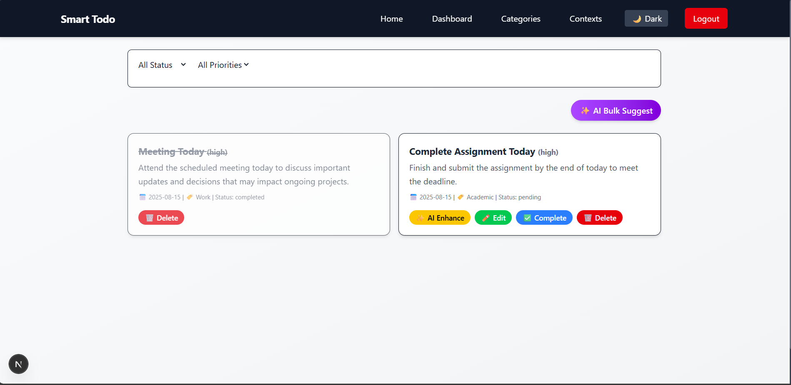
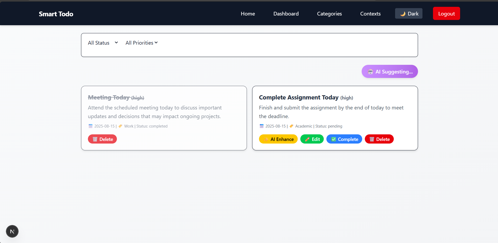
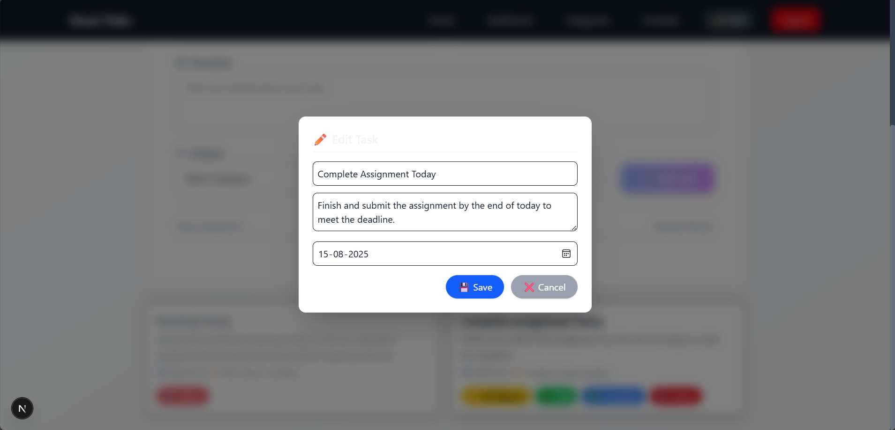
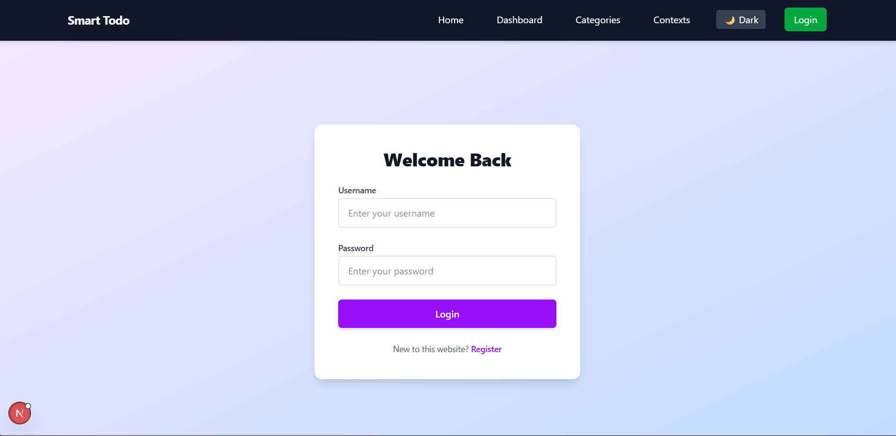
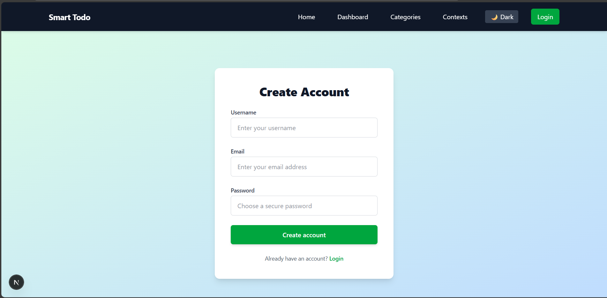
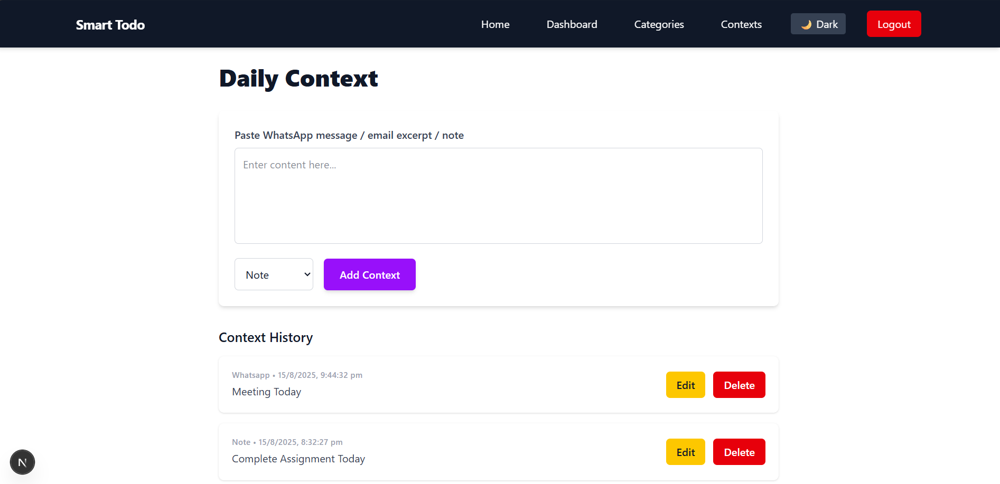
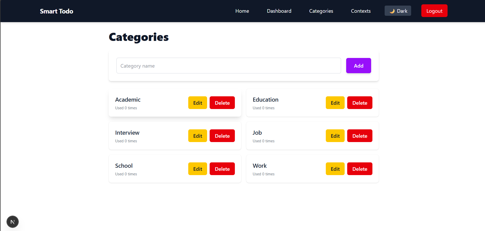

# Smart Todo + AI Dashboard

A fullstack productivity app featuring:
- User registration and JWT-based login
- AI-enhanced ToDo Suggestions
- Daily Context Tracking
- Categories Management
- Beautiful & Responsive UI (React/Next.js + Django REST Framework)

---

##  Authentication Features

- User registration and login.
- Protected APIs require JWT authentication using [SimpleJWT](https://django-rest-framework-simplejwt.readthedocs.io/en/latest/).
- Access and refresh tokens for secure, stateless session management.

---

##  Setup Instructions

### 1. Backend (Django + DRF)

#### Prerequisites
- Python 3.8+
- PostgreSQL (or SQLite for dev)
- Virtual environment tool (venv or pipenv)

#### Steps

cd todo_backend
python -m venv venv
source venv/bin/activate # Windows: venv\Scripts\activate
pip install -r requirements.txt

Configure your PostgreSQL settings in backend/settings.py
python manage.py migrate
python manage.py runserver # Defaults to http://localhost:8000

### 2. Frontend (Next.js / React)

#### Prerequisites
- Node.js 14+
- npm or yarn

#### Steps

cd todo_frontend
npm install
npm run dev # Defaults to http://localhost:3000

---

## 🔌 API Documentation

### Authentication

- `POST /api/register/` — Register a new user  
  - Payload: `{ username, password, email }`
- `POST /api/token/` — Get JWT access and refresh tokens (login)  
  - Payload: `{ username, password }`
- `POST /api/token/refresh/` — Refresh access token using refresh token  
- `POST /api/token/verify/` — Verify token validity

### Tasks

- `GET /tasks/` — List all tasks (requires auth)
- `POST /tasks/` — Add a new task
- `PUT /tasks/{id}/` — Update task entirely
- `PATCH /tasks/{id}/` — Partial update (e.g., mark as completed)
- `POST /tasks/{id}/ai-enhance/` — Enhance task via AI
- `POST api/ai/bulk/` — Enhance bulk tasks via AI

### Categories

- `GET /categories/` — List categories
- `POST /categories/` — Create category
- `PUT /categories/{id}/` — Update category
- `DELETE /categories/{id}/` — Delete category

### Contexts

- `GET /contexts/` — List context entries
- `POST /contexts/` — Add new context

---

##  How Authentication Works

- After registering/logging in, backend returns JWT tokens.
- Frontend must include `Authorization: Bearer <access_token>` header in all protected API requests.
- Access tokens expire; use refresh tokens to obtain new access tokens.

---

##  Screenshots

**Home View**  

**Dashboard View**  

**AI Bulk Suggestion View**  

**Edit Todo View**  

**Login View**  

**Register View**  

**Add/Edit Context Management**  

**Categories Management**  

---

## 📄 Sample Tasks

[
{
"id": 1,
"title": "Finish quarterly report",
"description": "Draft and review the Q2 financial report.",
"priority_score": 8,
"status": "pending",
"category_name": "Work",
"deadline": "2025-08-30"
},
{
"id": 2,
"title": "Plan team outing",
"description": "Choose location and send invites.",
"priority_score": 6,
"status": "completed",
"category_name": "HR",
"deadline": "2025-08-15"
}
]

---

## Sample AI Suggestions

- "Split large tasks into actionable subtasks for better progress."
- "Add due dates to high priority items to improve timeliness."
- "Clarify task descriptions to improve team understanding."

---

##  Example Context Data

[
{
"content": "Discussed quarterly targets in WhatsApp group.",
"source_type": "whatsapp",
"created_at": "2025-08-15T10:41:00Z"
},
{
"content": "Received meeting follow-up email.",
"source_type": "email",
"created_at": "2025-08-14T12:30:00Z"
}
]

---

##  Development Notes

- Backend uses Django + Django REST Framework + SimpleJWT for auth.
- Frontend uses React with Next.js and Tailwind CSS.
- Code is modular, clean, and documented for maintainability.

---

